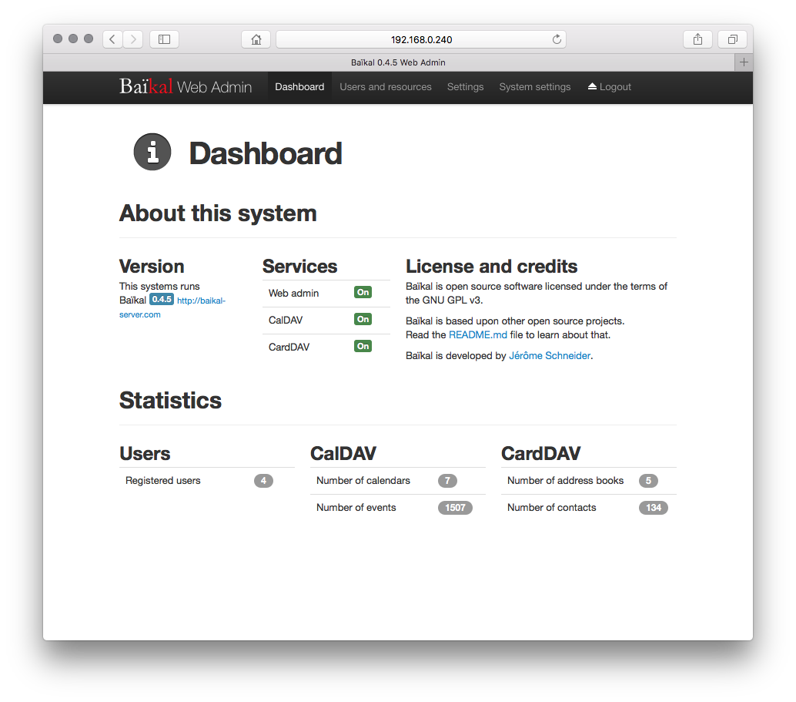

<!--
注意：此 README 由 <https://github.com/YunoHost/apps/tree/master/tools/readme_generator> 自动生成
请勿手动编辑。
-->

# YunoHost 上的 Baïkal

[](https://dash.yunohost.org/appci/app/baikal)  

[](https://install-app.yunohost.org/?app=baikal)

*[阅读此 README 的其它语言版本。](./ALL_README.md)*

> *通过此软件包，您可以在 YunoHost 服务器上快速、简单地安装 Baïkal。*  
> *如果您还没有 YunoHost，请参阅[指南](https://yunohost.org/install)了解如何安装它。*

## 概况

Baïkal is a lightweight CalDAV+CardDAV server. It offers an extensive web interface with easy management of users, address books and calendars. It is fast and simple to install and only needs a basic PHP capable server. The data are stored in a MySQL database. Baïkal allows to seamlessly access your contacts and calendars from every device. It is compatible with iOS, macOS, DAVx5 on Android, Mozilla Thunderbird and every other CalDAV and CardDAV capable application. Protect your privacy by hosting calendars and contacts yourself with Baïkal.

**分发版本：** 0.9.4~ynh3

**演示：** <https://demo.yunohost.org/baikal/admin/>

## 截图



## 文档与资源

- 官方应用网站： <https://sabre.io/baikal/>
- 官方用户文档： <https://sabre.io/baikal/install/>
- 官方管理文档： <https://sabre.io/dav/>
- 上游应用代码库： <https://github.com/sabre-io/Baikal>
- YunoHost 商店： <https://apps.yunohost.org/app/baikal>
- 报告 bug： <https://github.com/YunoHost-Apps/baikal_ynh/issues>

## 开发者信息

请向 [`testing` 分支](https://github.com/YunoHost-Apps/baikal_ynh/tree/testing) 发送拉取请求。

如要尝试 `testing` 分支，请这样操作：

```bash
sudo yunohost app install https://github.com/YunoHost-Apps/baikal_ynh/tree/testing --debug
或
sudo yunohost app upgrade baikal -u https://github.com/YunoHost-Apps/baikal_ynh/tree/testing --debug
```

**有关应用打包的更多信息：** <https://yunohost.org/packaging_apps>
